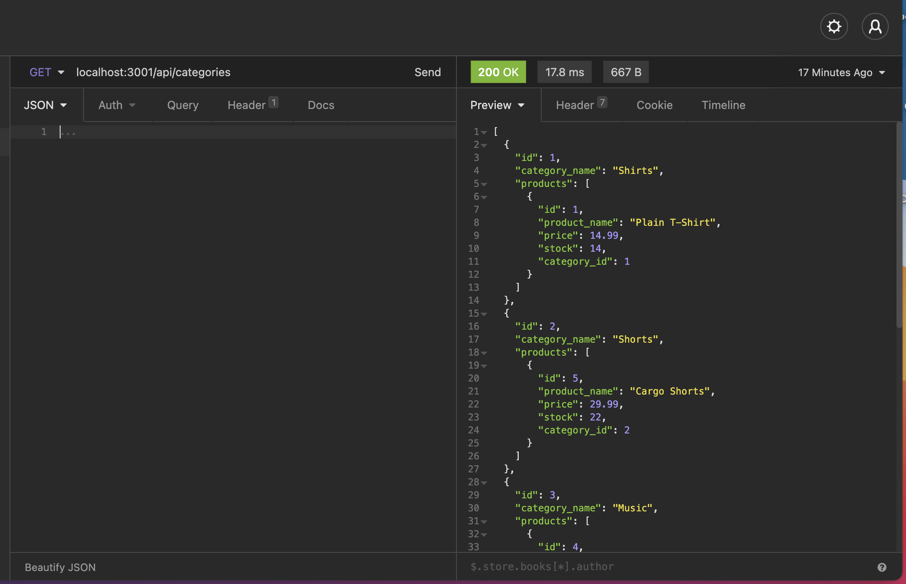
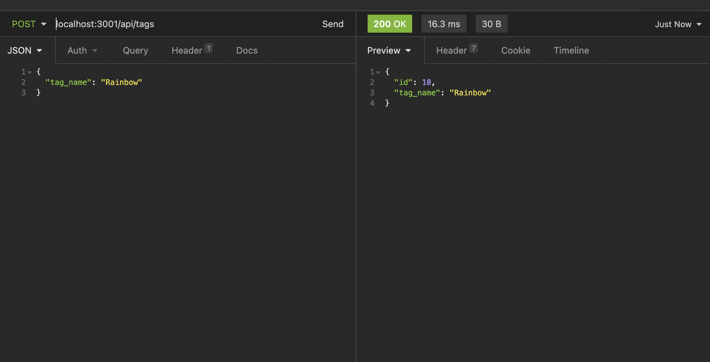
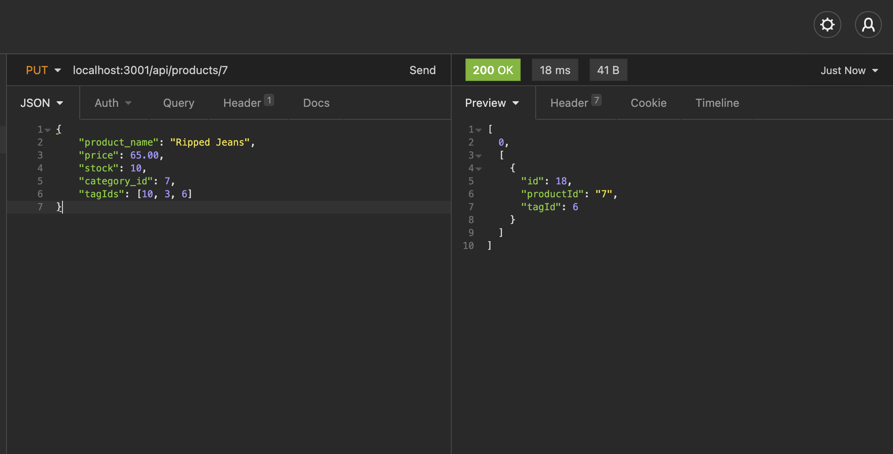
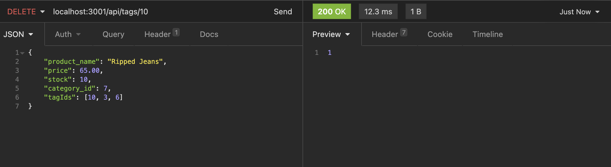
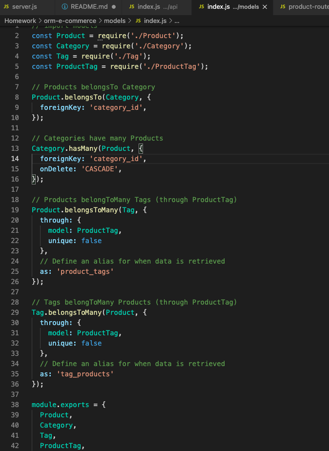
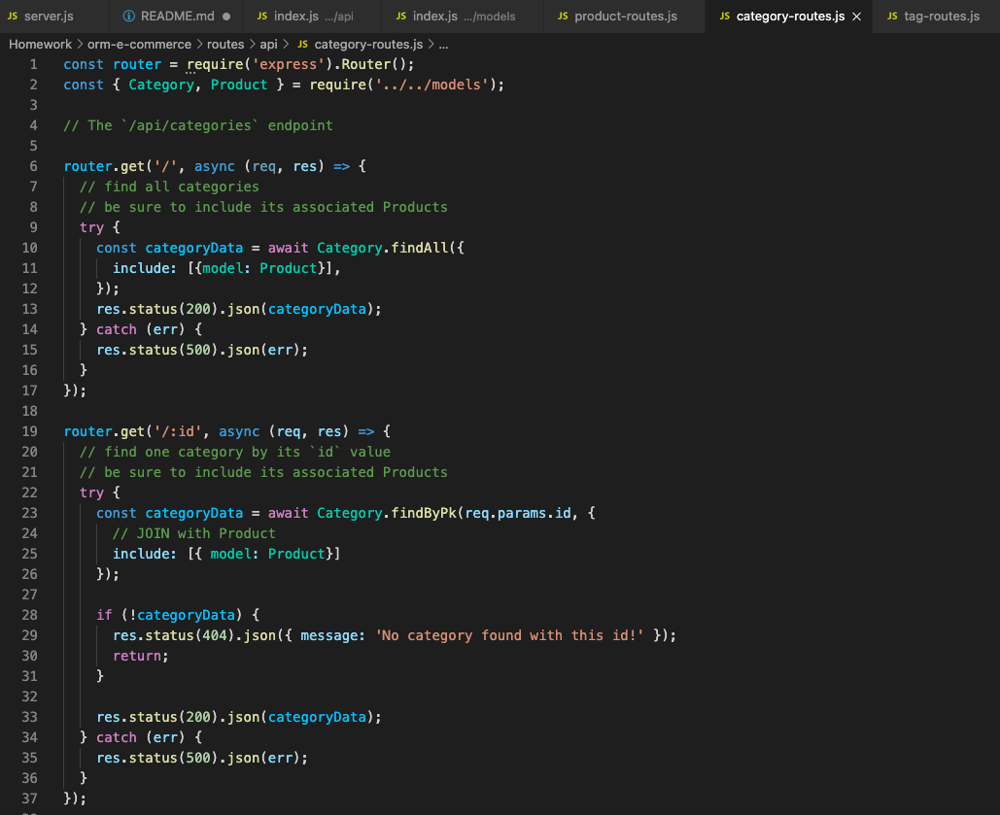
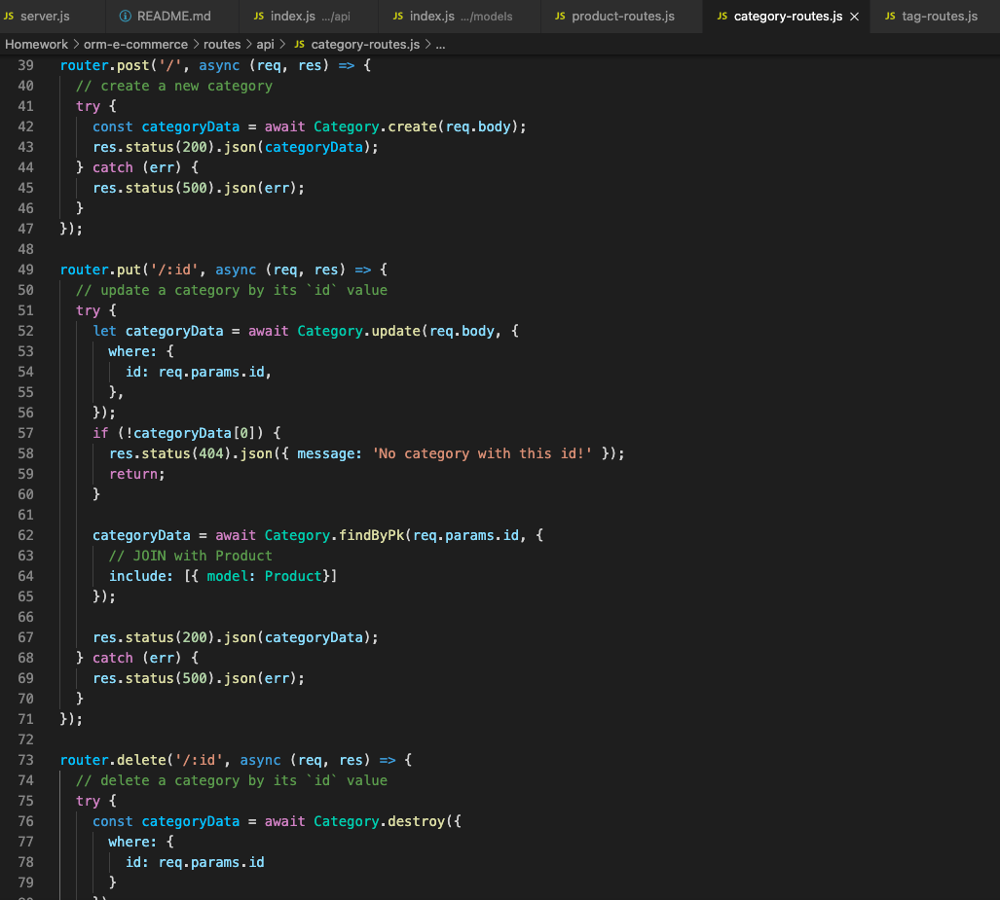

# Object Relational Mapping- E-Commerce Back End

## Links
Link to walkthrough video [Video Link](https://drive.google.com/file/d/1zZJ4myCeQ0WKwZWJmH4tT5EXXnKHsDwM/view?usp=sharing)

## Summary
Built the back-end server for an e-commerce website using a combination of express.js and sequelize. Using Insomnia to show the functionality of the application as shown in the video linked above. The main purpose of this project was to use ORM (Object Relational Mapping) which is the concept and practice of writing queries like the ones from MySQL databases with javascipt or any other object oriented programming language. 

## Table of Contents
1. [Usage](#usage)
2. [Set Up](#set-up)
3. [What I Learned](#what-i-learned)
4. [Resources](#resources)

## Usage
Once the database has been created and seeded the server is then launched using "npm run start" from the command line. This commands starts the server and from there you can run RESTful CRUD operations through Insomnia to test or mock the back-end server operations of the e-commerce website. Operations are run on three of the models (categories, products, and tags). The Get operator will pull up and display in formatted JSON all the table information that was defined in the model. 

The Post method is used to create a new category, product, or tag. Put will update any on the items from the models, and Delete will delete a certain JSON object based on the model and the id the user passes into the url.

A sample of what some of the operations look like. 
Get Route: 

Post Route: 

Put Route: 

Delete Route: 

## Setup
This application is just the back-end server and database part of the e-commerce website. The server is set up using express, and sequelize is used to make the adding and maipulating of the database easier. 

The dotenv package was added to use environment variables to store sensitve data in a .env file with the database name, the username, and password. The inital setup of the database was done in MySQL Workbench as usual. After initializing the database it was seeded using "npm run seed" in the command line. 

There are four models: category, products, product-tags, and tag. The index file sets up the associations between the different models. Category to Product is a one to many association and Product to Tag is a many to many association. The models are the tables that would be set up in MySQL workbench but can be typed out as javascript using sequelize. 

The other main part of the application is the API routes. There are five files that setup the APIs used to interact with the models. The index.js file in the routes folder creates the router. The index.js file in the api folder is like the table of contents that sets up all the connections of the other API routes. The route files are where the CRUD operations are used. The Get API is associated with the find method (either findAll or findByPk), POST API is linked to the create method, PUT is update, and DELETE is linked to the destroy method.

These operations are mocked or tested in Insomnia to show their functionality. To watch how they work view the video which is linked at the beginning of this README. 

## What I Learned
Sequelize was very helpful in setting up the database and writing the functionality for the routes. Ansynchronous functions used in the routes files were much easier to get working than those in the employee-tracker-sql.

## Resources
* [Npm MySQL2](https://www.npmjs.com/package/mysql2)
* [Npm Sequelize](https://sequelize.org/master/)
* [Npm dotenv](https://www.npmjs.com/package/dotenv)
* [Sequelize Validation and Constraints](https://sequelize.org/master/manual/validations-and-constraints.html) 
* [Sequelize Associations](https://sequelize.org/master/manual/assocs.html#many-to-many-relationships) 